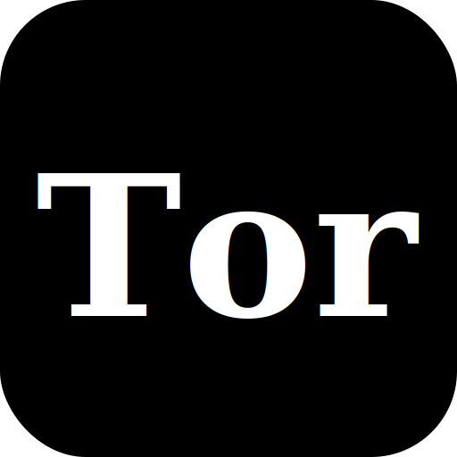

<p align="center">
   <a href="https://the-tor.vercel.app/"></a>
</p>
<p align="center">
  <a href="https://nextjs.org/"></a>
  <a href="https://tailwindcss.com/"></a>
  <a href="https://framer.com/motion/"></a>
  <a href="https://vercel.com/"></a>
</p>

# 📸 Wedding Photography Portfolio

A minimal and elegant portfolio website built to showcase wedding photography.  
This project serves as both a personal showcase and an open-source reference for anyone who wants to create a creative static site using **Next.js**, **Tailwind CSS**, and **Framer Motion**.

---

## ✨ Features

- 🎞️ Responsive photo gallery showcasing wedding moments  
- ⚡ Fast and fully static — hosted on **Vercel**  
- 🎨 Clean, modern UI with **Tailwind CSS**  
- 🎬 Smooth, lightweight animations using **Framer Motion**  
- 🖼️ All images stored locally in the `public/` folder  
- 💡 Easy to update, customize, and redeploy  

---

## 🧱 Tech Stack

- **Next.js** – React framework for building static and dynamic web apps  
- **React** – Core UI library  
- **Tailwind CSS** – Utility-first CSS framework  
- **Framer Motion** – Animation library for React  
- **Vercel** – Hosting and deployment platform  

---

## 🚀 Getting Started

1. Clone the repository
```bash
git clone https://github.com/Th0ngpv/the-tor-portfolio
cd photography-portfolio
```
2. Install dependencies
```bash
npm install
```
3. Run the development server
```bash
npm run dev
```
Then open http://localhost:3000 in your browser.

4. Build for production
```bash
npm run build
npm start
```
---

### 🖼️ Adding Your Photos
All photos are stored inside the /public/images/ directory.
To add or update your gallery:

- Place new images in /public/images/.
- Update any gallery or component that references them.
- Rebuild and redeploy the site.

---

### 🌐 Deployment
This project is deployed on Vercel.
Every commit to the main branch triggers an automatic deployment.

To deploy your own version:

- Push your repository to GitHub.
- Import it into Vercel.
- Set the framework preset to Next.js.
- Click Deploy — that’s it!

---

### 💡 Inspiration
Built with modern web technologies while preserving a classic, cinematic feel — designed to be elegant, fast, and affordable to maintain for a small freelance photographer.

---

### 🤝 Contributing
Contributions, feedback, and ideas are welcome!

- Fork this repository.
- Create a new branch.
- Make your changes and submit a pull request.

---

### 🧑‍💻 Author
Pham Viet Thong (Bill Pham)

Freelance Web Developer

📧 thongpv160605@gmail.com

## 📁 Project Structure

This project follows the **Next.js App Router** pattern with localized content, reusable components, and static assets stored in the `public` folder.

```plaintext
.
├── app/                     # Next.js app router pages
│   ├── favicon.ico
│   ├── layout.tsx
│   ├── page.tsx
│   ├── albums/
│   │   ├── page.tsx
│   │   └── [slug]/page.tsx
│   └── contact/
│       └── page.tsx
│
├── components/              # Reusable UI components
│   ├── AlbumPage.tsx
│   ├── FeaturedWeddings.tsx
│   ├── Lightbox.tsx
│   └── Navbar.tsx
│
├── context/                 # Theme & language contexts
│   ├── LanguageContext.tsx
│   └── ThemeContext.tsx
│
├── data/                    # Album metadata
│   └── albums.ts
│
├── locales/                 # Translations (English / Vietnamese)
│   ├── en.json
│   └── vi.json
│
└──styles/                  # Global styling
    └── globals.css

  public/                  # Static assets
    ├── favicon.svg
    ├── hero-wedding.jpg
    ├── icons/
    │   ├── facebook.svg
    │   ├── instagram.svg
    │   ├── location.svg
    │   ├── mail.svg
    │   └── phone.svg
    └── albums/
        ├── dana-kuda/
        │   ├── 01.jpg ... 10.jpg
        ├── phuong-tuan/
        │   ├── 01.jpg ... 10.jpg
        ├── dana-kuda-copy/
        │   ├── 01.jpg ... 10.jpg
        └── phuong-tuan-copy/
            ├── 01.jpg ... 10.jpg
```
